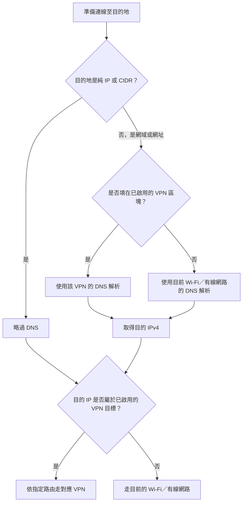

# VPN 分流管理器

一個 Windows 桌面應用程式，用來把指定的 IPv4 網段、IP、網域或網址導向 FortiClient、F5 或 Ivanti VPN。

程式會自動偵測已連線的 VPN 網卡，並建立 Windows IPv4 路由與 DNS 分流規則。填入某個 VPN 區塊的網域只會交給該 VPN 的 DNS 解析，解析出的 IPv4 位址也會走該 VPN；未列入的名稱與 IPv4 流量則繼續使用目前的 Wi-Fi 或有線網路。停用所有分流或關閉程式時，會移除由本程式建立的路由與 DNS 規則。

## 運作原理

DNS 與路由是兩個不同的步驟：DNS 只負責把網域名稱轉成 IP，Windows 再依目的 IP 的路由決定流量走 VPN 或目前的 Wi-Fi／有線網路。直接使用純 IP 時不需要 DNS。

- 填在已啟用 VPN 區塊的 IP 或 CIDR：不查 DNS，直接建立走該 VPN 的路由。
- 填在已啟用 VPN 區塊的網域或網址：使用該 VPN 的 DNS 解析，再讓解析出的 IPv4 位址走該 VPN。
- 未列入任何已啟用 VPN 區塊的網域與 IP：使用目前網路的 DNS 與路由。
- 開啟程式或按「重新偵測 VPN」時，程式會讀取網卡、路由與 DNS 資訊；若上次異常結束留下本程式管理的路由或 NRPT 規則，也會在這時清除。程式不會修改網卡 DNS；只有按下「啟用分流」後才會新增路由與本程式的 NRPT 規則。

F5 VPN 連線本身可能把 F5 DNS 設成 Windows 的優先 DNS。因此，在尚未啟用本程式的分流規則，或停用／關閉本程式之後，一般網域仍可能被 Windows 交給 F5 DNS。啟用新版分流後，未列入的網域會明確使用目前網路的 DNS，只有填在 F5 區塊中的網域或網址才使用 F5 DNS。



## 使用方式

需要 Windows 11 與 Rust stable。在專案目錄執行：

```powershell
cargo run
```

啟動時請同意 UAC 權限要求，讓程式能修改 Windows 路由。

1. 在 FortiClient、F5 或 Ivanti 區域輸入目的地，每行一筆。
2. 連線 VPN；如果沒有顯示正確網卡，按「重新偵測 VPN」。
3. 有多張候選網卡時，選擇實際連線使用的網卡。
4. 按「啟用分流」建立路由。
5. 需要修改內容時，先按「停用分流」。

輸入範例：

```text
192.0.2.0/24
203.0.113.8
gitlab.example.test
http://gitlab.example.test:1500/
```

網址會依主機名稱解析成 IP；通訊協定、路徑與連接埠不影響 Windows 路由結果。若 VPN 完全取代實體網卡目前顯示的 DNS，程式會改用該網卡原本設定或由 DHCP 取得的 DNS，避免未列入的網站也被送往 VPN DNS。

## 安裝

完成開發與測試後，以固定位置安裝 release 版本：

```powershell
& .\scripts\install.ps1
```

腳本會執行 locked release build、要求系統管理員權限、將程式安裝到
`C:\Program Files\Rust VPN Splitter`，並建立開始功能表捷徑。工作列應釘選這個
已安裝版本，不要釘選 `target` 內的建置產物。

再次執行同一腳本即可更新已安裝版本。安裝完成後執行 `cargo clean` 不會移除
已安裝的程式。

安裝腳本也遵循 Cargo 的 `CARGO_TARGET_DIR`。若端點防護軟體鎖住標準
`target` 路徑，可先將這個環境變數設為專案內另一個建置目錄再執行安裝。

## 解除安裝

```powershell
& "C:\Program Files\Rust VPN Splitter\uninstall.ps1"
```

解除安裝會移除程式與開始功能表捷徑，但保留 `%APPDATA%` 中的使用者設定。
